## 高并发应用中的挑战

随着互联网快速发展、传统行业IT转型，很多应用的流量越来越高，高并发成为服务端中的一个重要挑战，在高并发场景下，只使用数据库来承担流量，
会遇到各种各样的问题和挑战。

本文分为三个部分，首先我们了解下高并发场景下常见的一些关于缓存的问题，然后给出一些通用的缓存设计模式解决方案，最后我们分析一下知乎中的一些功能点进行技术方案设计。

### 估算一个场景的浏览量功能需要的资源

现在我们用知乎这个app来分析，以实现其中的浏览量功能为例，来看一下我们可能会遇到哪些问题。

  

我们要实现的浏览量功能，核心需求分为两个部分，一个是展示浏览量，上图中在回答列表中会出现这个回答的浏览次数，另一个是记录浏览量也就是增加浏览量，当用户在浏览一个回答时，会增加这个回答的浏览量。

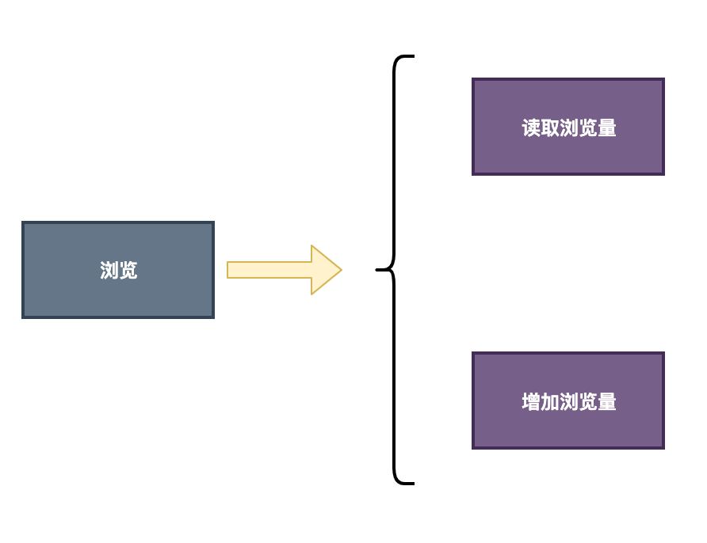  

要实现这个的功能，如果只用数据库，我们先分析一下需要的资源，整体架构是从客户端发送请求到服务端，服务端请求数据库进行数据的读写，由于查询浏览量可能是批量查询（一个列表中每个回答都要查询浏览量），所以客户端请求量到数据库的请求量之间可能有一定的放大。

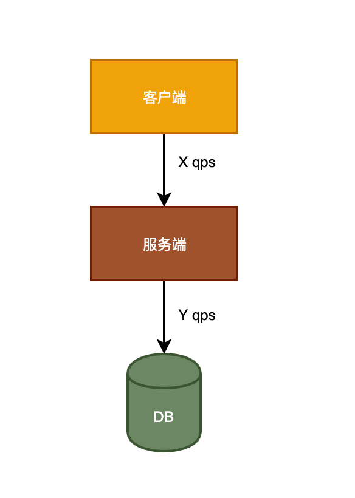  

单个数据库有它的性能上限，当用户增多请求量变大单个数据库无法承担读写压力时，一般通过增加数据库从节点数量来提高读能力，通过数据库的分库分表增加写能力。

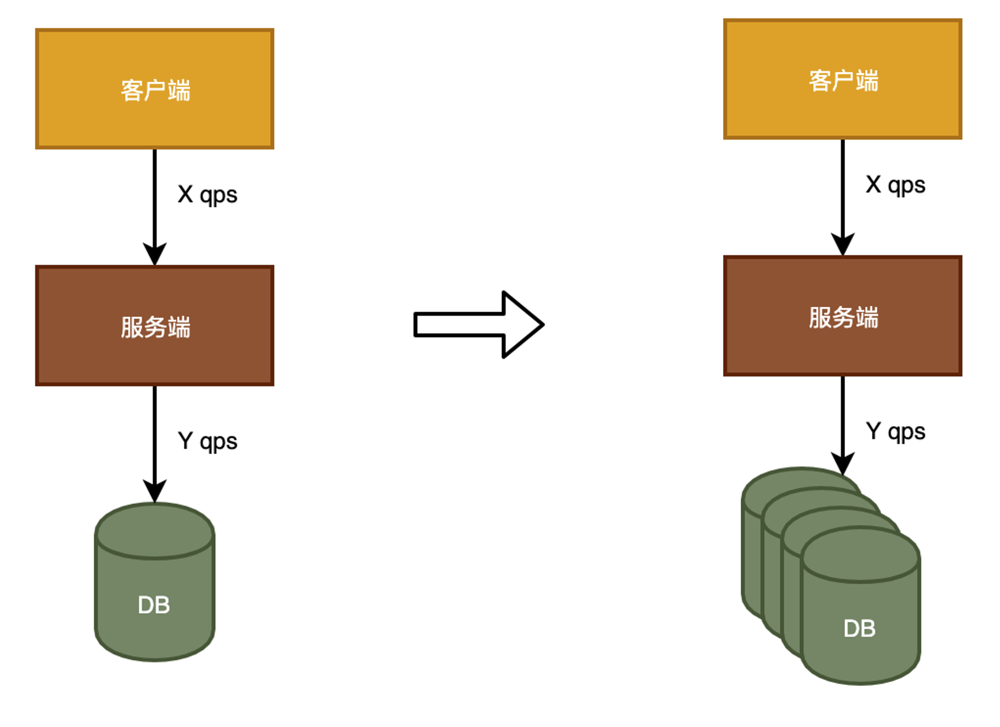  

假设我们的回答列表接口QPS是10w qps，每个列表10个回答，浏览回答接口qps 10w qps，那么读100w qps，写10w qps，按照每个数据库能够承担1w写qps2w读qps估算，我们至少需要10个数据库分库，每个数据库中1主4从配置。整体是50个数据库机器，是一个不少的机器成本，而且数据库机器的配置一般都比较高比如ssd硬盘大内存等。

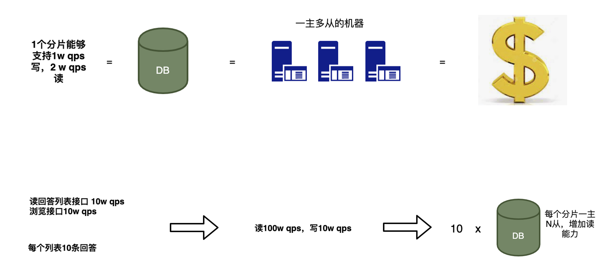  

### 上述估算还只是理想情况

上面的估算看似合理，但是如果上线后很可能会遇到一个非常严重的热点问题。

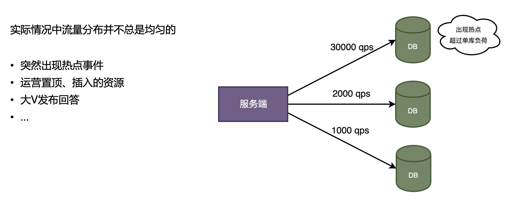  

在真实的应用场景中，各个回答的流量并不是均匀的，很像二八原则，所以我们的系统中很可能需要少数的几个回答它们的浏览量明显比其他的回答高很多，
比如突然出现一个热点事件，像某某明星结婚，运营还可能置顶一些回答，或插入广告回答，还有可能某个粉丝非常多的大V发布回答出现在粉丝的关注列表中。
这些情况都可能导致某些回答的浏览量读写出现比较高的QPS，也就是出现热点，当热点出现后，我们上一部分按照每个数据库分库承担1/10 qps也就是1w读2w写的估算被打破了，虽然可能整体没有10w的浏览量写qps，但是某个数据库分片的写qps已经超过了1w，甚至可能更高。

### 数据库压力缓解妙招 - 加缓存

为了减少数据库的压力，通常大家都能想到增加服务端缓存，服务端缓存（比如redis、memcached）是非常常用的服务端组件。它有几个常见的优点

1. 性能好，缓存一般都是内存内的kv操作，相比数据库需要完成事务逻辑，缓存的性能高很多，比如单个数据库的查询qps一般认为比较难达到10w qps，但是单个缓存可以比较轻松的实现几十万qps甚至上百万的qps。
2. 延迟低，缓存一般比数据库的操作更快，并且缓存还可以用在缓存一些数据查询上，比如我们要在app中展示天气，天气数据是我们调用第三方的http获得的，因为天气数据并不会变化很快，所以我们可以加上一定时间的缓存，一方面能降低天气数据的查询耗时，另一方面也可以降低第三方接口的查询量。
3. 使用简单，缓存不需要像数据库一样提前建表，使用比较灵活，也不用sql语句操作，而是用sdk的api，比较简单

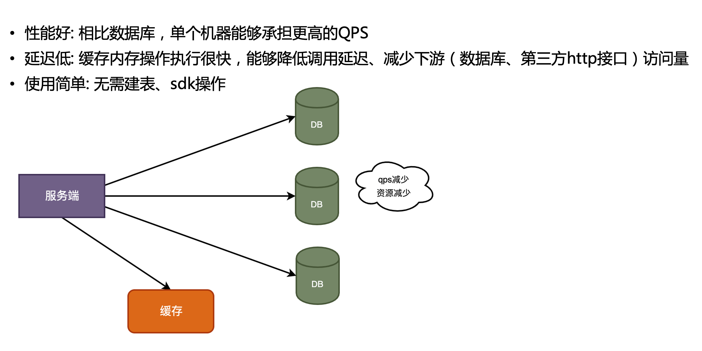  

### 加了缓存，其他的问题也接踵而来

添加了缓存之后，数据库压力有了一定降低，但是我们仍然可能遇到很多问题

#### 高并发常见问题 - 缓存数据一致性

添加缓存后最常见的一个问题就是缓存数据一致性问题，在之前我们的数据只保存在数据库中，最多只可能出现主从同步延迟导致主动数据延迟，但是在增加缓存后，我们就需要使用其他的方式来保证一份数据在缓存和数据库之间的一致性，不同的一致性保证方案有不同的优缺点。

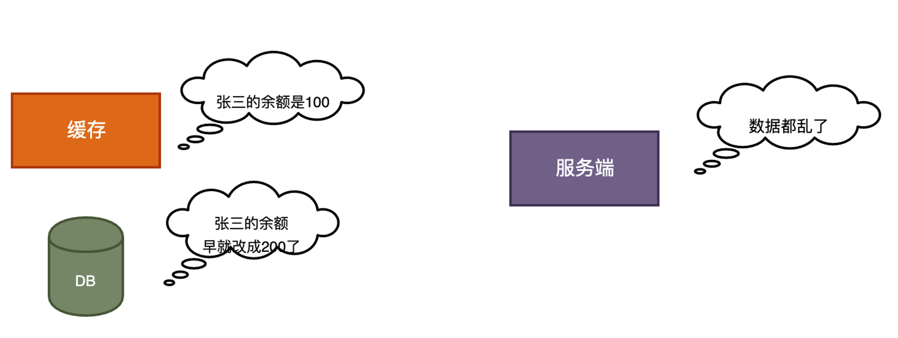  

#### 高并发常见问题 - 缓存可靠性

添加了缓存之后，数据库压力大大减小，但是缓存服务的机器可能出现故障，如果出现故障，内存中的数据可能会丢失（Redis有aof数据备份但是memcached并没有这类功能），当缓存重启后，大量缓存查询没有命中缓存，这些请求会穿透（回源查询）到数据库，给数据库带来巨大压力，也能导致数据库查询阻塞服务故障。

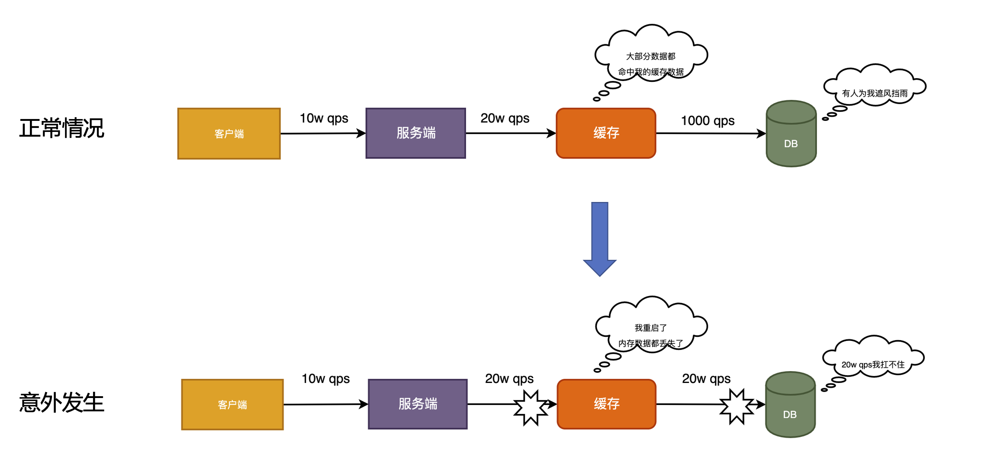  

#### 高并发常见问题 - 缓存穿透

另一个经常出现的问题是缓存穿透，如果某个数据并不存在（删除了或者非法输入），则这些数据的查询也会穿透到数据库中，但是数据库中也没有这些数据，如果不进行特殊处理缓存中也不会写入对应的数据，则每次查询这些数据都会穿透到数据库，可能导致数据库压力变大，这就是缓存穿透

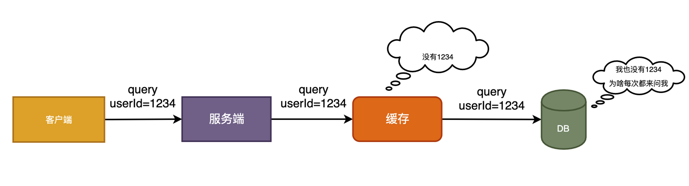  

#### 高并发常见问题 - 缓存热点

虽然缓存的性能比数据库高很多，但是缓存服务本身也有性能上限。比如Redis服务因为是单线程处理请求，只能利用一个CPU，在因为热点导致单个实例请求量比较大的情况下可能会因为io同步读写过多导致请求阻塞或者因为处理的操作时间复杂度较高导致cpu利用率用满。

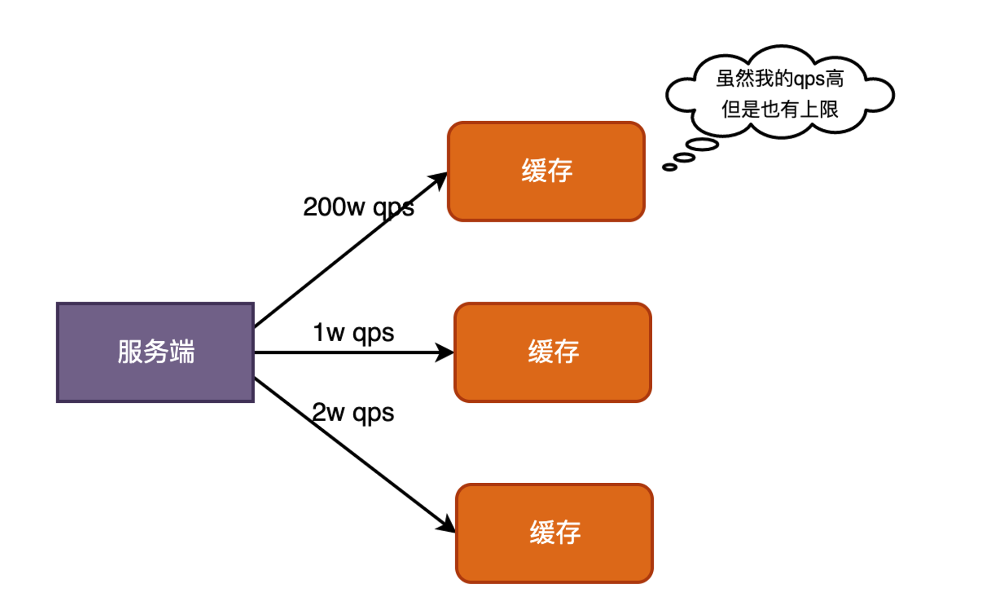  

#### 高并发常见问题 - 需求复杂度

实际开发过程中产品需求往往会越来越复杂，如何在高并发情况下高效的支持复杂的功能也是一个挑战，比如前面的浏览功能，还能够引申出很多需求，像展示用户有没有浏览过某个回答，用户查看自己的浏览历史列表、按照浏览量进行排行、查看关注的人最近浏览了哪些回答等等功能。

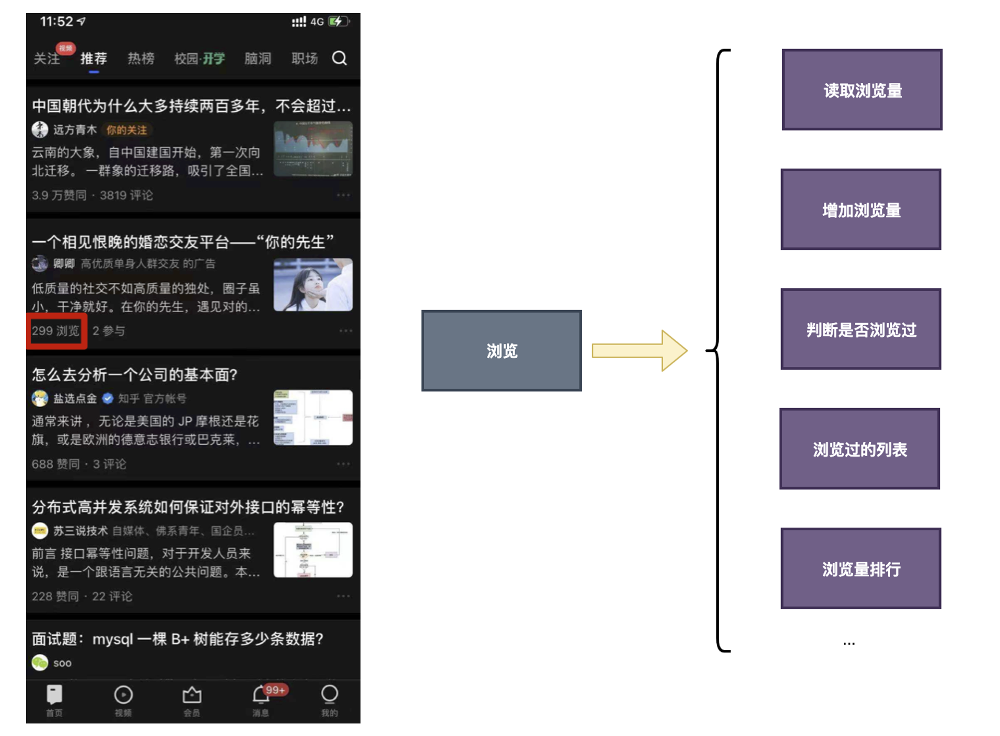  

### 常见缓存设计模式

了解了一些常见的问题和挑战，我们了解一下通用的缓存设计模式和解决方案

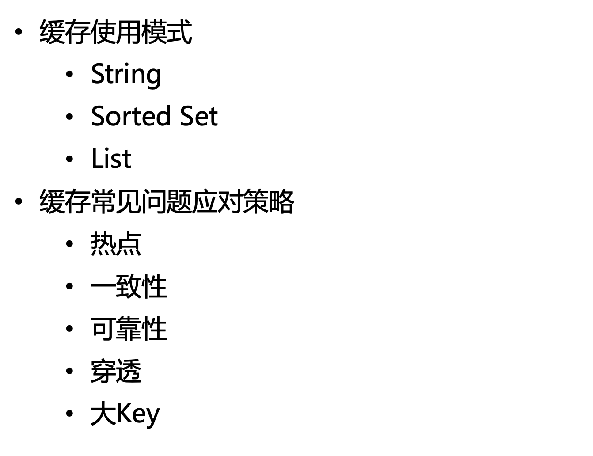  

#### 常见缓存设计模式 - Redis String

Redis String是一个非常常用的数据结构，除了最基本的kv存储，String还可以表示int值，并且有原子类的增加减少操作，来实现计数类的需求。
例如，搭配上过期时间，我们可以实现固定时间内的计数限制功能，在知乎app里，为了防止恶意用户恶意发送大量回答，我们要限制每个用户每天(0点到24点）最多只能发表100个回答，
那么我们可以在用户每次发表回答前增加计数，并且设置过期时间为当前时间到24点之间的差值，这样就实现了计数限制功能。分布式接口限流功能也能用类似的方案来实现。

  

分布式锁也是一个很常见的组件，假设用户发表回答的接口中有很多子流程，可能有并发问题，我们不希望一个用户同时发表多个回答，通过分布式锁可以实现。利用Redis的setnx以及过期时间就能实现一个分布式锁。

  

#### 常见缓存设计模式 - Redis Sorted Set

Redis中的Sorted Set（也称为zset）也是一个非常常用的数据结果，在业务需求中，会有大量的列表功能，而列表一般都是以某种规则排序的，Sorted Set正好具备列表和排序的能力。比如评论、点赞、排行榜等场景的产品功能，都能通过Sorted Set来实现。我们以回答点赞功能为例，把回答id作为member，点赞数据库记录的自增id作为score，要查看自己的点赞列表，则可以用zrevrangebyscore命令，点赞/取消点赞可以用zadd/zrem实现，判断有没有点赞过使用zscore结果是否为空实现（如果查询的参数比较多、点赞列表长度不大，也可以把点赞列表都查出来内存中判断）

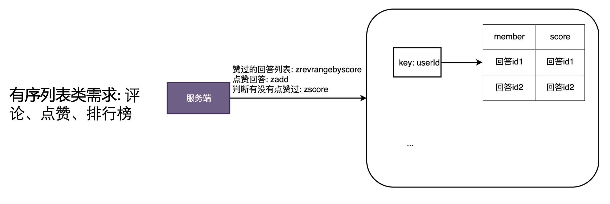  

除了实现列表类需求，sorted set还能够实现延迟队列（下单30分钟后未支付关闭订单）、餐厅等待队列等功能。

#### 常见缓存设计模式 - Redis List

List是Redis中另一个数据结构，它在一些场景中也有很好的使用效果。比如抢红包的场景，假如知乎要增加一个在知乎群聊中的发红包抢红包功能，那么在发红包时，如何保证一个红包最多只被一个用户抢到呢？

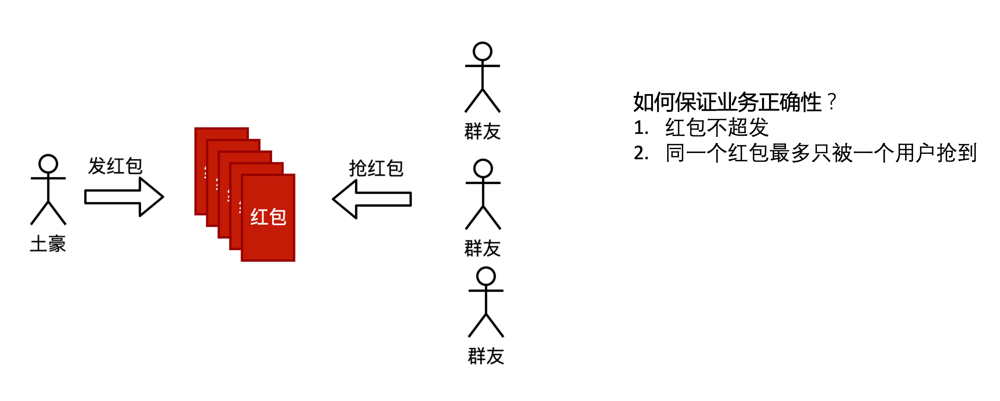  

这是类似秒杀的需求场景，我们可以用Redis的原子性特点实现上面的一个红包最多只被一个用户抢到的需求，我们用List数据结构保存待发送的红包列表，发红包就是把大红包拆分成若干个小红包push到大红包id的key所在的List队列中，抢红包通过pop从队列中获取红包。

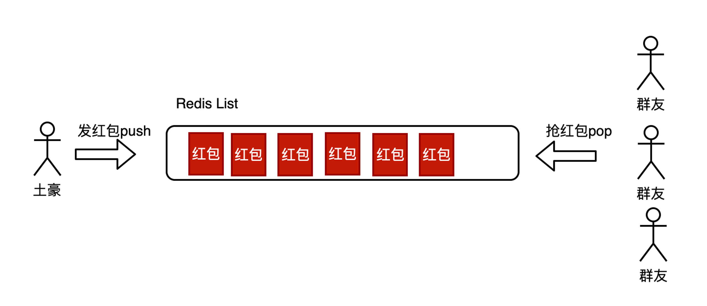  

这个方案在用户量比较小的情况下没有什么问题，但是在群成员数量可能比较多比如10万人的情况下可能有什么风险呢？因为用户特别多，所以某个大红包上的pop请求qps可能非常高，导致这个Redis缓存出现热点。

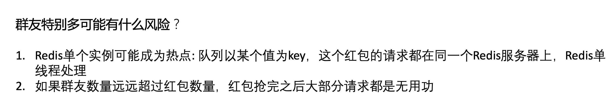  

要解决这个问题，可以用一个解决热点问题非常常用的方法 - shard分片，把一个大红包拆分到多个分片上，比如3个shard的情况，在大红包原有的key后面再追加_0,_1,_2，在有多个Redis实例的情况下，这三个key就很有可能落在不同的Redis实例上，缓解了单个实例的热点问题。

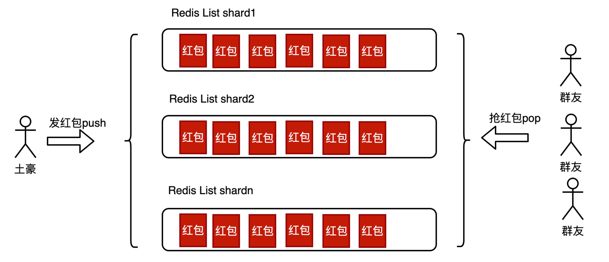  

另外如果群里的人数特别多，远远超过了拆分后小红包的数量，我们可以提前做一定比例的拦截，让这些请求直接返回没抢到，也能降低一定的请求压力。

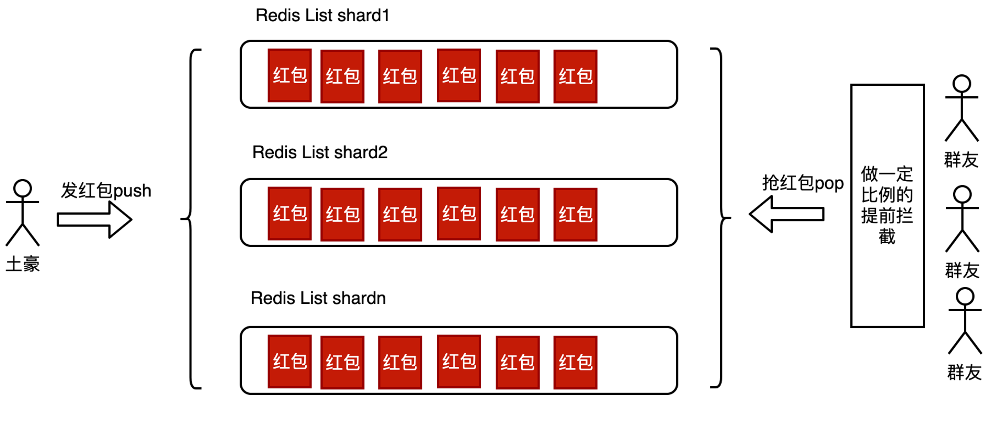  

#### 常见缓存设计模式 - 其他数据结构

Redis中还有一些其他比较实用的数据结构。像HyperLogLog能够实现去重计数、Geo实现地理位置功能、BloomFilter用少量内存实现集合。

  

#### 常见缓存设计模式 - 批量

我们在使用缓存时，应该注意尽量使用批量或pipeline的方式请求，在请求多个数据时，相比串行请求可以减少整体的调用耗时，也可以使用Redis的lettuce客户端库异步接口。

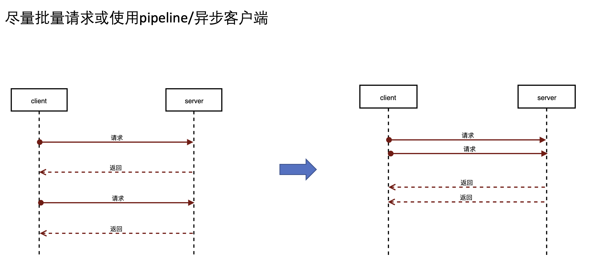  

### 常见缓存问题解决思路

了解了一些缓存的设计使用模式后，下面我们了解一些常见的缓存问题的解决思路。

#### 缓存热点问题解决思路 - 本地缓存

本地缓存是一种缓存热点问题的常用手段，Java中的guava库中提供了LoadingCache本地缓存，具备淘汰、过期、刷新等功能。

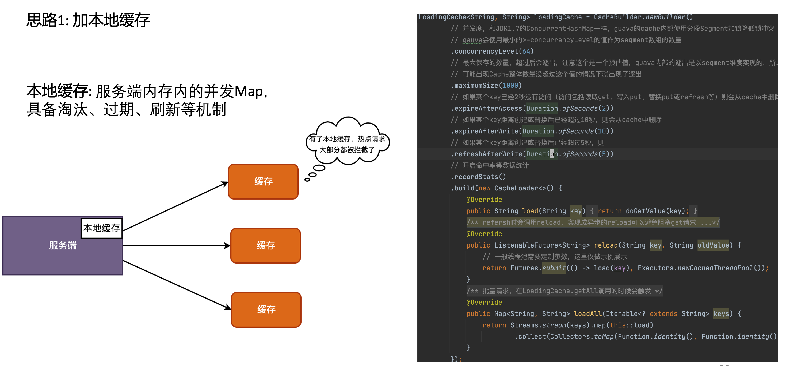  

本地缓存除了解决热点问题，还适用于保存一些整体数据量不大、变化不大的数据，比如知乎首页如果有置顶的广告信息，则可以保存在本地缓存中减少下游服务资源的请求量。
使用本地缓存的时候，我们要注意监控本地缓存的占用内存大小、命中率等信息，可以通过sizeOf等工具查看Java中一个对象的包含引用图的所有关联引用对象的内存大小。

#### 缓存热点问题解决思路 - shard

上面提到的群聊抢红包中我们提到了shard拆分方案，shard是一种解决热点问题的方案，适合于解决写缓存出现热点的情况（写缓存一般不能通过本地缓存解决，计数类可以累加聚合写的情况除外）

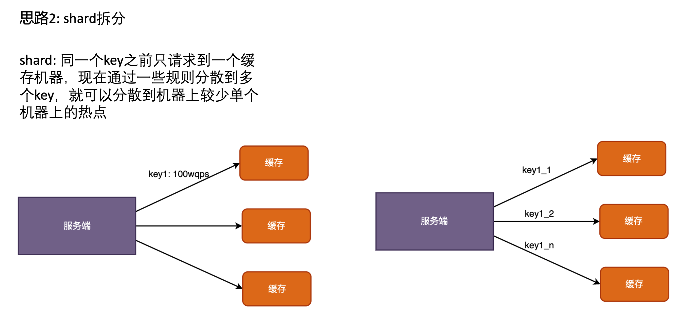 

#### 缓存热点问题解决思路 - 使用memcached代替redis

redis使用起来虽然非常方便，但是性能上不如memcached，所以还可以通过memcached代替redis来实现，缺点就是memcached没有提供很多数据结构支持，也缺少一些官方自带的运维工具（比如主从同步）。

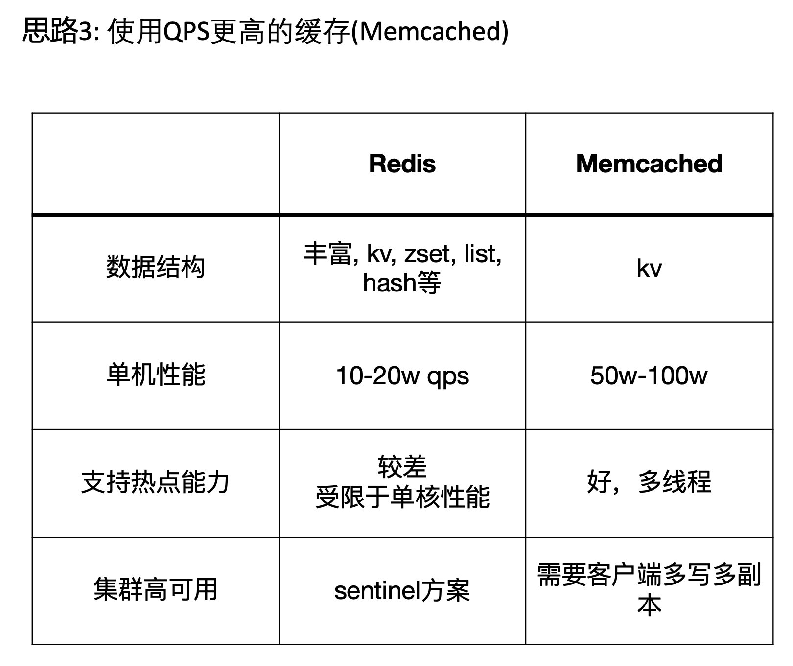  

#### 数据一致性解决方案 - 简单使用中的问题

很多程序中对于缓存的使用比较简单，使用思路为先读缓存，缓存中查不到则查询数据库，然后把结果写到缓存中。修改数据时，则修改数据库并修改缓存

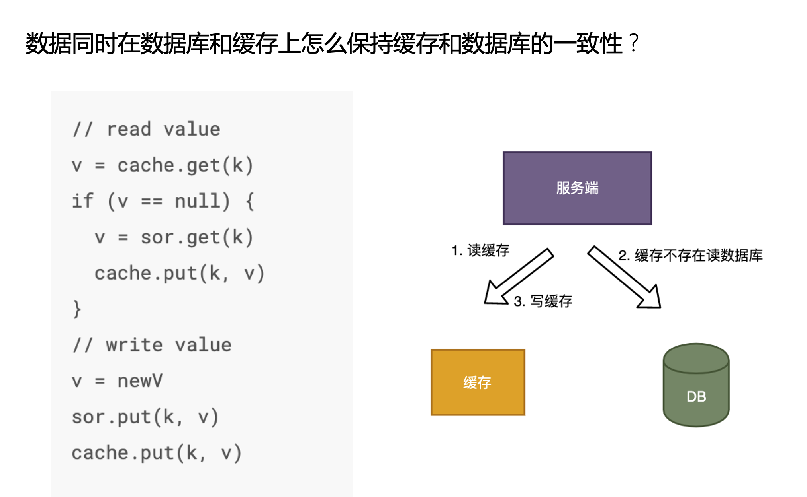  

这种数据一致性方案在同一个key有并发操作时，可能出现数据不一致问题。数据不一致问题的根本原因是对于同一个key在缓存中的修改操作，没有并发控制手段，类似线程不安全问题，可能出现并发修改的情况导致数据出现被覆盖等问题。下图中展示了一种可能出现的导致缓存中数据不正确的时序，实际情况中还有很多其他时序导致数据不一致。

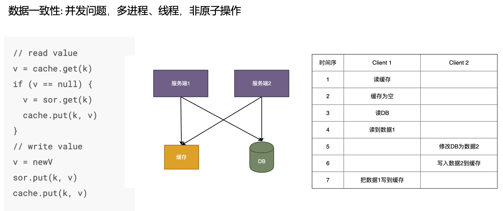  

#### 数据一致性解决方案 - 通过专门的缓存加载服务来修改缓存

为了尽量保证数据一致性，我们应该保证（或尽量保证）同一个缓存key的缓存添加、删除操作在同一时间只有一个进程、一个线程来负责。这里可以增加一个专门的CacheLoader服务，它是一个RPC服务，通过定制化的路由策略（比如一致性hash）保证一个key只路由到一个机器进程上，然后在这个进程内对key进行加锁同步，保证同一个key的缓存添加、删除操作的串行处理。

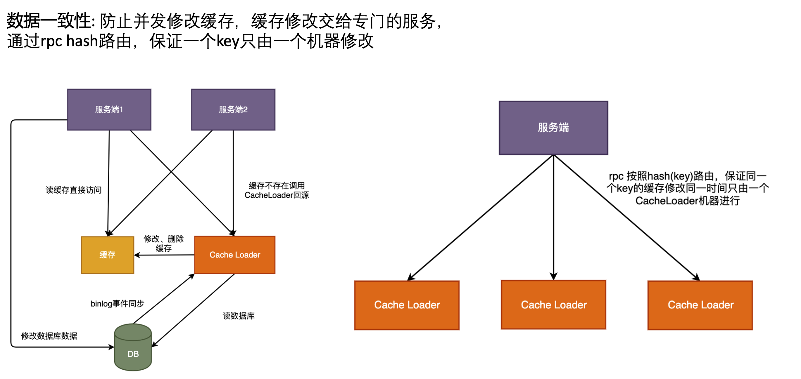  

当我们的服务查询缓存发现数据不存在时，调用CacheLoader服务从数据库中加载数据并写入到缓存中，然后返回数据。当修改数据后，通过消费数据库的binlog事件，交给CacheLoader去删除缓存。
另外因为数据库可能出现主从不一致的情况，所以如果对一致性要求比较高，我们应该消费从库的binlog、CacheLoader尽量读取主库，再对缓存数据添加上一定时间的过期来尽量保证一致性。
缓存一致性中还有一些极端case，比如binlog数据是在数据库事务提交前发送出来的，可能binlog修改后查询查到旧数据（事务未应用时）。

#### 缓存可靠性问题解决方案 - 横向扩展、多副本

分片和副本是分布式系统中常见的两个模式，通过分片，我们能够实现缓存内存、qps的扩展能力，并且也减少了机器故障的影响面，通过多副本（redis sentinel主动同步），可以实现机器故障后快速切换并且尽量保证数据不丢失。

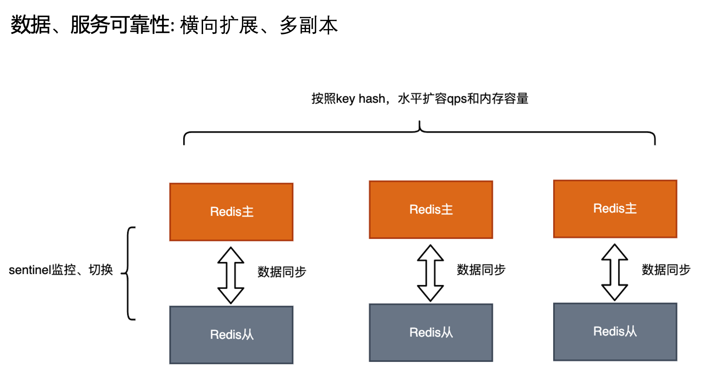  

#### 缓存穿透问题解决方案 - 增加数据空占位符

通过增加空占位符（特殊标记），可以解决缓存穿透问题。

  

缓存是一个非常通用的概念，维基百科中的定义是`a store of things that will be required in the future, and can be retrieved rapidly`，缓存在前端页面、服务端、甚至CPU中都有各自的缓存。
本文主要介绍服务端中的缓存架构和应用，缓存是服务端开发中最常用的中间件之一。

#### 缓存大key问题解决方案 - 截断列表保证数据量

缓存大key是指一些key对应的value值数据太大，比如Sorted Set列表长度太长，几十万，这样的数据在查询时，一方面可能消耗比较多的cpu（有些操作时间复杂度不是O(1)），另一方面在io传输时会占用比较多的io、带宽开销。

此类大key问题可以通过截断数据、使用memcached保存两种方式解决。截断数据是指缓存中只保存一部分常用的数据，比如sorted set中保存最近的一些数据，超过一定长度后进行数据截断，如果要查询更多数据则到数据库中查询。

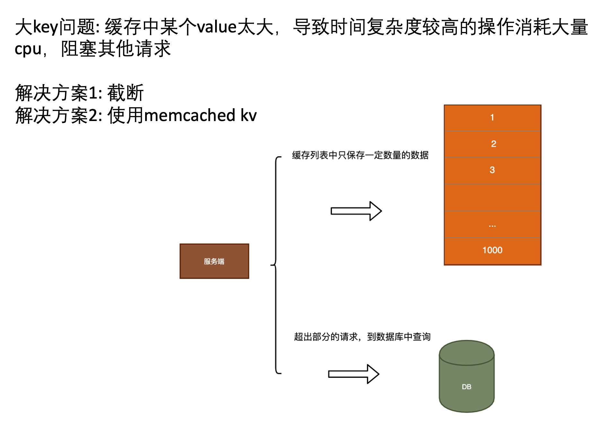  

### 缓存设计实战

掌握了一些缓存设计模式和问题解决方案后，我们找一些比较真实的需求来进行技术方案设计。

  

#### 缓存设计实战 - 关注粉丝功能

关注粉丝功能是大多数app中都具备的产品功能，我们来设计实现这个功能的数据库表和缓存设计，数据库表是两个方向的关系记录表，分为两个方向是因为在分库分表时，要按照不同的维度来分库分表。
缓存都使用sorted set来实现。

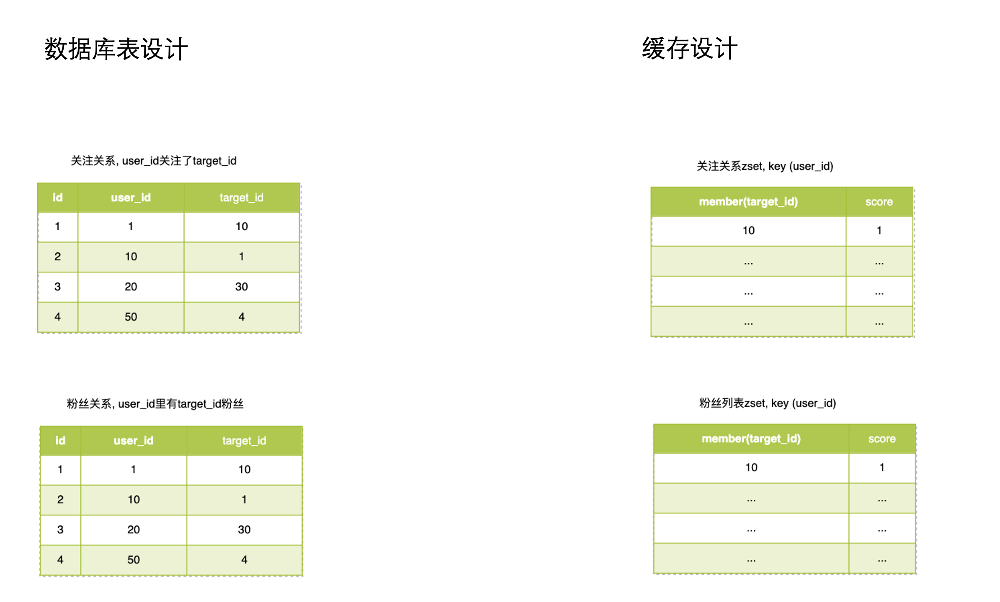  

然后关注粉丝的常见操作都能利用sorted set的已有操作来实现

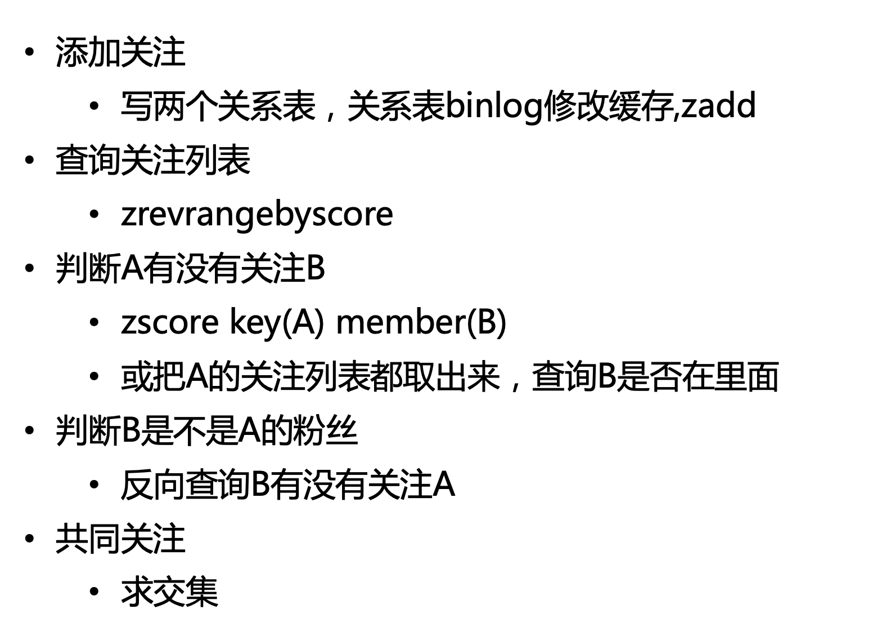  

#### 缓存设计实战 - 关注信息流

有了关注粉丝功能后，另一个app中普遍具备的功能是查看关注的人发表的信息流。比如查看用户关注的人的发表了哪些回答，按照时间倒序排列。
这里可以给每个用户的信息流缓存保存一个sorted set保存信息流内容的id列表，用户发表完信息后会同步到所有粉丝的信息流缓存中，查看信息流缓存就是查询自己的sorted set。这里需要特殊考虑的是粉丝比较多的大V的处理，可以在读时单独请求大V的信息，也就是推拉结合的方式。

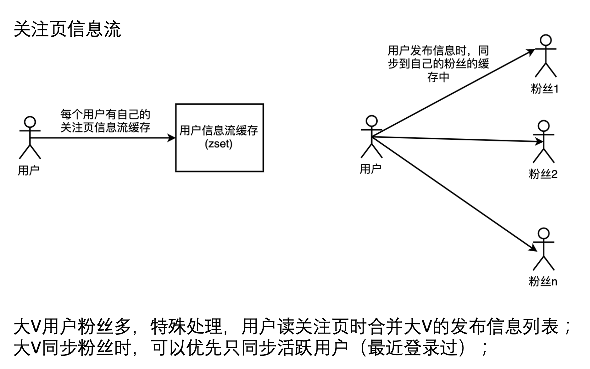  

#### 缓存设计实战 - 高性能计数器

计数器是一个非常实用的组件，计数需求在app中无处不在，比如关注粉丝数、阅读数、观看数、评论数等等。

  

但是要实现一个能够支持较高并发的计数器，还需要多做一些设计上的考虑，比如如何解决热点问题。

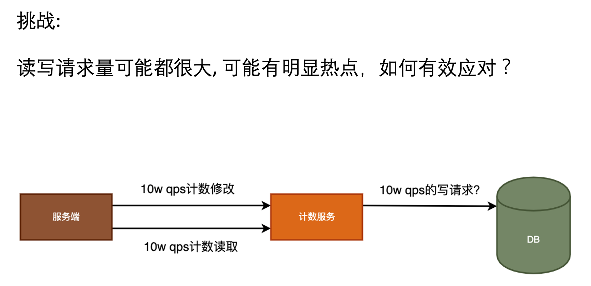  

首先我们解决写热点问题，其实我们可以发现计数器中关于某一个key的多次增加计数操作，可以合并成一个大的增加计数，来实现调用量的降低，这在热点key中能够有效的降低热点的流量。
我们实现一个单独的计数服务，技术服务中我们缓存最近N秒（比如1秒）的累加数据（比如Map<String, LongAdder>，然后定期写入到数据库中然后重置累加数据。

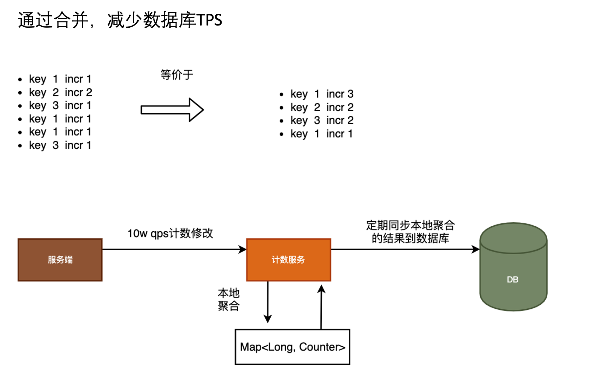  

写入到数据库后，通过数据库的binlog同步数据到缓存中(Redis string)，为了解决读热点问题，在调用方增加本地缓存。

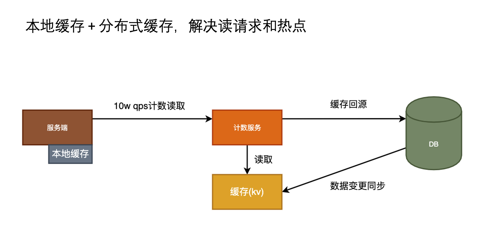  

#### 缓存设计实战 - 每日热榜

下面我们实现知乎中的每日热榜功能，每日热榜会把每日最热（热度值最高的，热度值按照一定的规则统计）的N个问题展示在列表中，所以热榜核心的两个功能部分是热度值的管理以及热度值排行实现。

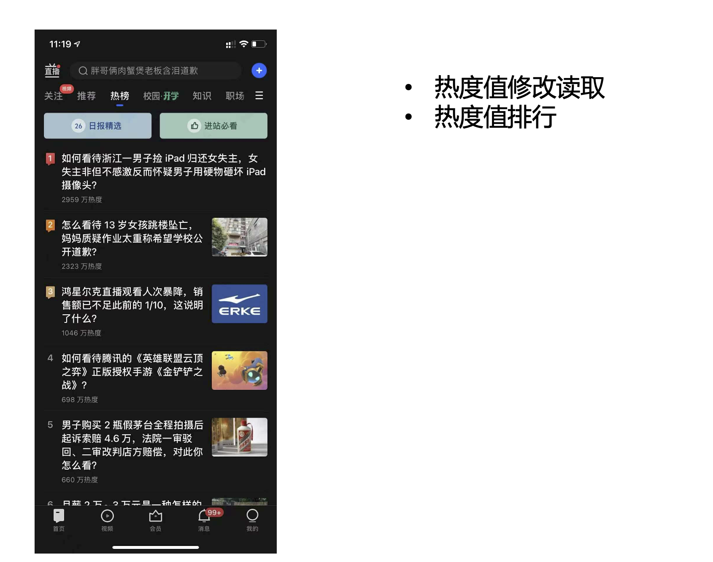  

热度值的读写通过我们刚刚介绍的高性能计数器的方案可以实现，特殊之处在于热度值多了一个每天的维度，所以缓存key上要加上日期的信息。热度排行自然可以使用Redis的sorted set来实现，zset的score为热度值，member为问题的id。

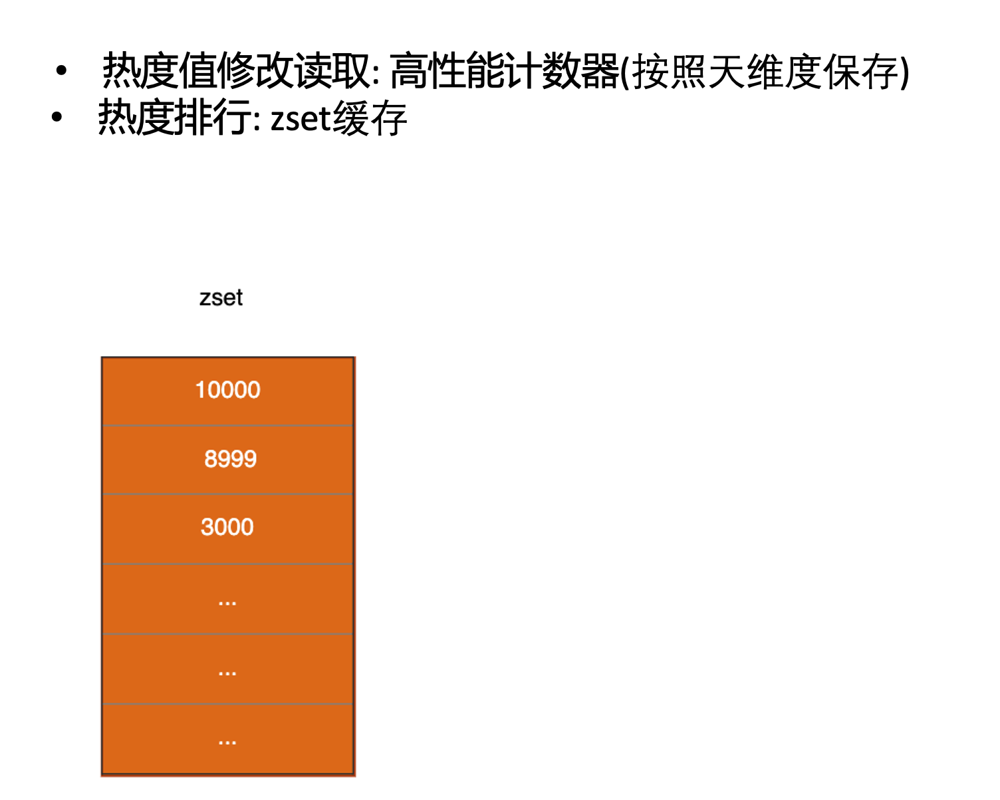  

由于热度榜的读写流量都很大，并且会产生热点，我们通过shard减少写热点问题我们把问题按照一定的hash写入到多个缓存key中也就是多个sorted set中，本地缓存解决读热点问题，并且读取时从这些shard分配中读取合并。由于问题的数量可能非常多，因此我们再做一个sorted set长度截断，就可以避免大key问题。

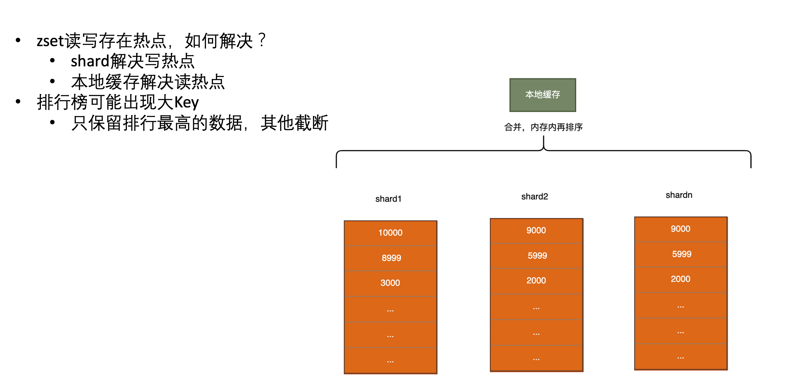  

有了这些设计方案后，我们再增加一些额外的服务保障，例如限流、降级、隔离等服务保障方案。

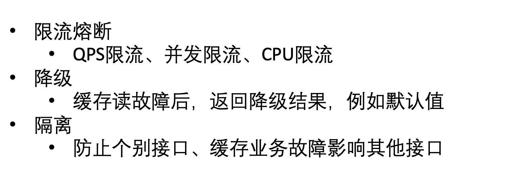  
