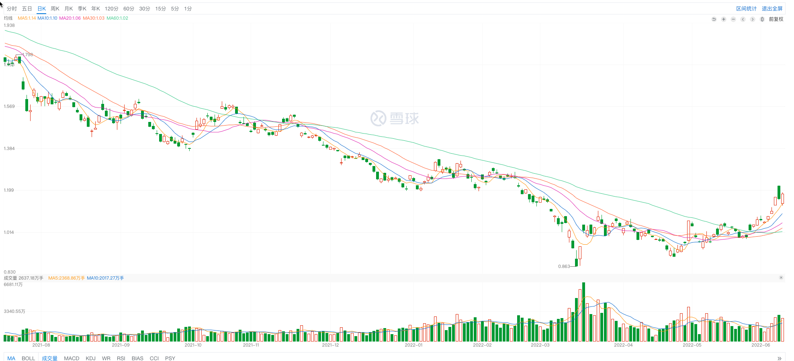

# 技术分析

你好，我是阳哥。本篇文章，我们来分析一些股票相关的核心概念和指标知识。

不同于网络上很多看不懂的说法，提出很多很玄学的词。

## 股票价格

股票本身是有价格的，我们去购买股票类似向别人购买商品，都有一个交易价格，
那么这个价格是怎么形成的呢，是谁来决定的呢？

这要从购买股票的根本目的说起，

一般来说，购买股票的原本目的是，公司发行一定的股票给投资者，投资者使用资金购买股票，公司筹集到资金后
去经营企业，从而获得利润，获得利润之后呢，进行分红也叫股息即股票利息，这样投资者就能够获得收益，所以本质上来说购买股票的终极目的
是等待股票对应的分红。

不过股票是允许进行买卖的，比如张三现在急需用钱，就把手里的股票卖给李四，最终的交易价格是双方博弈形成的，
比如如果股票价格卖的太高，李四简单估算，股息还没银行存款高或不如其他股票，就不会买，如果股票价格太低，会有其他购买人来争抢购买的权利。
所以价格也受市场的供需关系影响，大家都看好一个公司，购买股票的人就比卖出股票的人要多，相反如果一个公司发展的不好，被大家发现，
大家争抢卖出股票，就会导致价格降低。

所以呢股票对于投资者的核心价值是分红收益，股票能够进行买卖也能够通过交易获得收益。

当然有收益就有可能亏损，手里的股票可能会变得一文不值，所以投资一定要非常谨慎，考虑好出现异常情况如何应对，做好止损预案，避免出现大的损失。

股票价格决定机制、涨跌机制。

## 技术指标

股票里的技术指标是通过对交易的数据进行分析（成交价、平均成交价、成交量等），帮助投资者发现市场的变化趋势，辅助做决策。
通过技术指标，能够帮助我们分析出，现在市场资金对当前股票的一个态度。

如下图所示，大部分的股票网站都由很多花花绿绿的线段，就是各种技术指标的展示，下面我们来学习一下。

### k线

#### k线介绍

k线又称蜡烛图、阴阳线，如上图所示就是中国互联网ETF（513050）最近的一段k线。

k线是由一个个的柱状单元组成的，柱状中间还有一条线。每个单元表示的时间粒度，可以在图表配置中选择，可以是分钟、天、周、月、年等。
柱子的上下部分表示开盘价和收盘价，如果收盘价比开盘价高，则在国内一般会用红色表示，也称为阳线，反之收盘价比开盘价高，则会用
绿色表示，也称为阴线。不过要注意的是这里的高低是开盘价和收盘价的，还需要参考相对前一天的变化。
柱子中间还有一个线条，表示的是对应的周期内（比如日线就是一天）的最高价和最低价。

#### k线的作用

股价是由多（购买股票的）空（卖出股票的）双方博弈形成的结果，通过k线能够快速的看出每一天（或其他单位）的一个多空情况。

### MA（Moving Average移动平均线）

这几条不同颜色的线，就是移动平均线。

不同颜色表示不同天数（或其他粒度）的平均线，比如MA5表示是5日平均线，冒号后面的数字1.14表示当前鼠标停放的位置的平均线的值。

市场经济中，要赚钱无非是降低成本或者提高收入，以期获得较高利润。就股市而言，也就是要低买高卖，买时越低越好，卖时越高越好。然而，股价上窜下跳，并非个人的意志所能决定。因而，广大投资者，尤其是大众散户，一定要吃准大势，顺水行舟则可，逆势操作往往鸡飞蛋打。

那么，如何研判大势呢？在技术分析各项指标中，移动平均线是运用得最多、准确性也相对最好的指标之一。 要了解移动平均线，首先要掌握移动平均数。

在技术分析领域中，移动平均是一个较为重要的概念，不仅是移动平均线，而且一些技术指标，如乖离率、相对强弱指数、均量线等，都是在它的基础上建立起来的。

所谓移动平均，首先是算术平均数，如1到10十个数字，其平均数便是5.5；而移动则意味着这十个数字的变动。假如第一组是1到10，第二组变动成2到11，第三组又变为3到12，那么，这三组平均数各不相同。而这些不同的平均数的集合，便统称为移动平均数。

移动平均这一概念是建立在著名的道·琼斯理论上的。道·琼斯理论虽已名扬天下，但理论毕竟有点玄，而移动平均将这套理论加以数字化，从数字的变动中去预测未来股价短期、中期、长期的变动方向，更易为广大投资者所接受。

移动平均的另一个优点是它公开了平均成本这一秘密。事实上，移动平均数就是平均成本。另外，平均成本对于个股乃至大势的未来走向还有研判的作用。股价（或指数）的上下波动大，无规律性，不易看出它的趋势。而平均成本，其计算方法无非就是扣除前面的，加上当天的。如果走势是上升的--尽管其中有升有降- -但总的来说，是扣除前面一个小数字，加上后面一个大数字，平均成本势必与日俱增，待到有一日，平均成本远远超过了该股所值，走势必然要掉头向下。因为股价太高，购股成本日益增大，无人接手，而另一方面持股者则要忙不迭地清仓获利。市道有卖无买，自然是这种结果。

反之，走势向下时，总的来说是扣除前面一个大数字，加上后面一个小数字，平均成本势必越来越小，小到远远低于该股所值时，持股的套牢，自然不肯抛；空仓的以为时机已到，开始接手，行市到了有买无卖的时候，走势便要掉头转上了。

总之，扣除旧资料，增加新资料，这便是移动平均的真谛，也是技术分析的基础的所在。

当我们将每日不同大小的移动平均数标于图表上，连接起来，便得到一条上下起伏的曲线，这便是著名的移动平均线。

移动平均的种类很多，但总的来说，可分为短期、中期、长期三种。短期移动平均线主要是5日和10日的。5日的是将5天数字之和除以5，求出一个平均数，标于图表上，然后类推计算后面的，再将平均数逐日连起，得到的便是5日平均线。由于上证所通常每周5个交易日，因而5日线亦称周线。

由于5日平均线起伏较大，震荡行情时该线形象极不规则，无轨迹可寻，因而诞生了10日平均线，此线取10日为样本，简单易算，为投资大众参考与使用最广泛的移动平均线。它能较为正确地反映短期内股价平均成本的变动情形与趋势，可作为短线进出的依据。

第二类是中期移动平均线。首先是月线，采样为24、25或26日，该线能让使用者了解股价一个月的平均变动成本，对于中期投资而言，有效性较高，尤其在股市尚未十分明朗前，能预先显示股价未来变动方向。其次是30日移动平均线，取意仍是以月为基础，不过由于以30日为样，计算较前者简便，最后是季线，采样为72、73日或75日。由于其波动幅度较短期线移动平均线平滑且有轨迹可寻，较长期移动平均线又敏感度高，因而优点明显。

第三类是长期移动平均线，首先为半年线，采样146或150日，由于沪市上市公司一年分两次公布其财务报表，公司董、监事与某些消息灵通人士常可先取得这方面的第一手资料，进行炒作，投资者可借此获坐轿之利，不过由于沪市投机性浓厚，投资者注重短线差价利润，因而效果也打了点折扣。200日移动平均线，是葛南维(Granvile)专心研究与试验移动平均线系统后，着重推出的，但在国内运用不甚普遍。年线，取样255日左右，是超级大户、炒手们操作股票时参考的依据。

所有平均线种类不外乎上述几种，取样太小，线路不规则，取样太大，线路过于平滑，无明显转点，这是投资者应注意的。

N日移动平均线＝N日收市价之和／N

以时间的长短划分，移动平均线可分为短期、中期、长期几种，一般短期移动平均线5天与10天；中期有30天、65天；长期有200天及280天。可单独使用，也可多条同时使用。综合观察长、中、短期移动平均线，可以判研市场的多重倾向。如果三种移动平均线并列上涨，该市场呈多头排列；如果三种移动平均线并列下跌，该市场呈空头排列。

移动平均线说到底是一种趋势追踪的工具，便于识别趋势已经终结或反转，先的趋势正在形成或延续的契机。它不会领先与市场，只是忠实地追随市场，所以它具有滞后的特点，然而却无法造假。

### MACD

原理